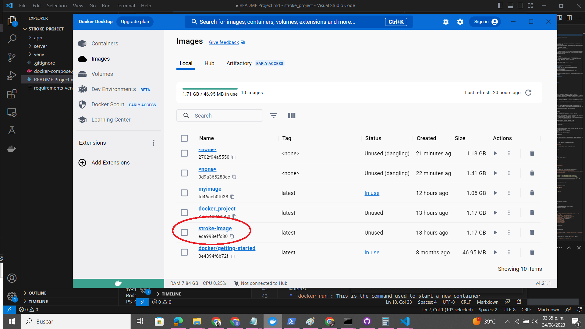
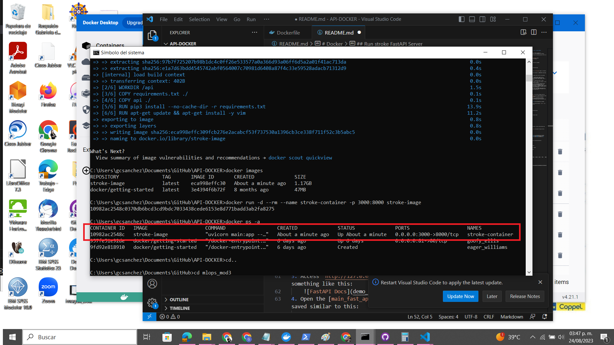
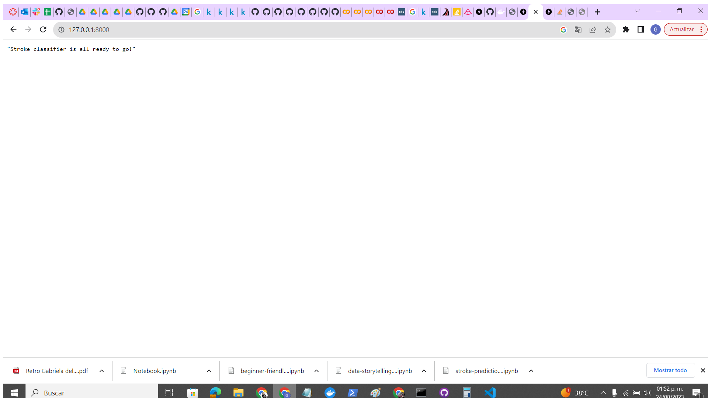
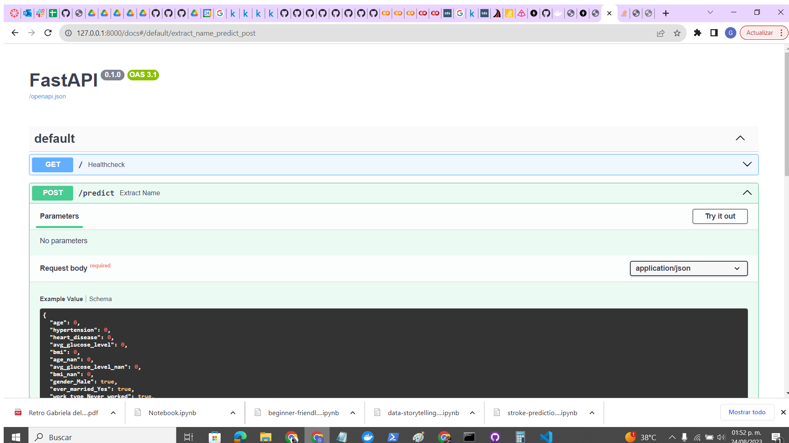

### Instructor: Carlos Mejia
### Student: Gabriela Sánchez

# Deliverable Module 4 - Project Stroke - Docker Desktop

# Docker

In this session, an introduction to Docker is given as a software-containing tool, essential in the deployment of ML models.

Information about how to package-migrate an existing project as API to an image of Docker is also given.

## Instructions

### Docker Desktop

Packaging/Containerizing our code to a Docker image helps, among other things, that we can deploy our system in multiple places.

In this deliverable, the goal is to create a Dockerfile containing the instructions needed to build an image with the API of the project they have worked on.

## Setup

* Change the directory to the `API-DOCKER` folder.
* Run the following code to build the image:

    ```bash
    docker build -t stroke_image .
    ```

* Inspect the image created by running this command:

    ```bash
    docker images
    ```

    Output in Docker Desktop:

    


## Run stroke FastAPI Server

1. Run the next command to start the `stroke_image` image in a container.

    ```bash
    docker run -d --rm --name stroke-container -p 3000:8000 stroke_image
    ```

    Where:
    * `docker run`: This is the command used to start a new container from a Docker image.

    * `-d`: This flag stands for "detached mode." When you run a container in detached mode, it means the container runs in the background, and you won't see its output in your terminal. This is useful for long-running services.

    * `--rm`: Removes the container automatically after it stops.

    * `--name stroke`: This flag assigns a name to the container. In this case, the container will be named "calculator".

    * `-p 3000:8000`: This flag is used to map ports between the host machine and the container. Ports are like endpoints that allow communication to and from the container. The format is -p hostPort:containerPort. In this case, it's mapping port 3000 from the host machine to port 3000 in the container. This is commonly used for accessing services running inside the container.

    * `stroke_image`: This is the name of the Docker image that you're using to create the container. You should replace "calculator" with the actual name of the image you want to use.

2. Check the container running.

    


## Checking endpoints

1. Access `http://127.0.0.1:8000/`, you will see a message like this `"Stroke Classifier is all ready to go!"`



2. Access `http://127.0.0.1:8000/docs`, the browser will display something like this:
    
